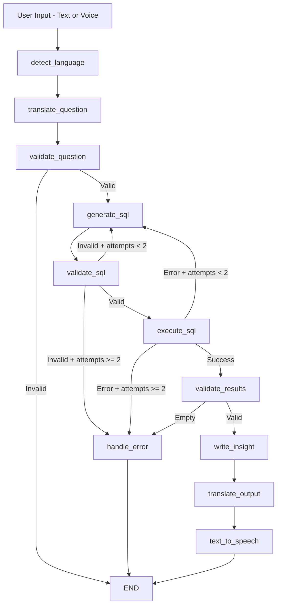

# 📈 Stock Market Intelligence Agent


A **LangGraph multi-agent system** that converts natural language questions about Nifty 50 stocks into data-driven business insights — with multilingual support for **English**, **Hindi**, and **Hinglish**.

---

## 🎬 Demo


---

## ✨ Features

- 🔄 **Natural Language to SQL** — Converts plain English (or Hindi/Hinglish) questions into valid MySQL queries
- 🧠 **10-Node LangGraph Agentic Pipeline** — Modular, stateful workflow with conditional routing and retry logic
- 🌐 **Multilingual Input & Output** — Supports English, Hindi, and Hinglish for both questions and insights
- 🎙️ **Voice Input** — Ask questions via microphone using speech recognition
- 🔊 **Text-to-Speech Output** — Insights read aloud in the detected language using gTTS
- 🛡️ **Guardrails** — Input validation, SQL safety checks, prompt injection detection, and hypothetical scenario filtering
- 📊 **LangSmith Tracing** — Full observability of every agent step for debugging and monitoring

---

## 🏗️ Architecture

The agent processes each question through a **10-node stateful pipeline** built with LangGraph:
## 🏗️ Architecture



**Error path:** At any validation failure (after retries), the pipeline routes to `handle_error → END`.

---

## 🛠️ Tech Stack

| Component              | Technology                |
| ---------------------- | ------------------------- |
| Agent Framework        | LangGraph                 |
| LLM                    | Google Gemini 2.5 Flash   |
| Database               | MySQL                     |
| ORM                    | SQLAlchemy                |
| Frontend               | Streamlit                 |
| Text-to-Speech         | gTTS                      |
| Speech Recognition     | SpeechRecognition         |
| Audio Processing       | pydub                     |
| Observability          | LangSmith                 |

---

## 📦 Dataset

| Detail       | Value                              |
| ------------ | ---------------------------------- |
| Source        | [Kaggle — Nifty 50 Stock Market Data](https://www.kaggle.com/datasets/rohanrao/nifty50-stock-market-data) |
| Period        | 2007 – 2021                        |
| Records       | 235,000+ rows                      |
| Stocks        | 50 Nifty 50 companies              |
| Sectors       | IT, Banking, Pharma, FMCG, Automobile, Oil & Gas, Metals, Energy, Cement, Telecom, Infrastructure, Financial Services, Consumer Goods, Chemicals, Media |

---

## 🚀 Setup

### 1. Clone the repository

```bash
git clone https://github.com/your-username/Stock-Market-Intelligence-Agent.git
cd Stock-Market-Intelligence-Agent
```

### 2. Install dependencies

```bash
pip install -r requirements.txt
```

### 3. Configure environment variables

Create a `.env` file in the project root:

```env
GOOGLE_API_KEY=your_google_api_key

DB_HOST=localhost
DB_USER=root
DB_PASSWORD=your_mysql_password
DB_NAME=nifty_db

LANGCHAIN_TRACING_V2=true
LANGCHAIN_ENDPOINT=https://api.smith.langchain.com
LANGCHAIN_API_KEY=your_langsmith_api_key
LANGCHAIN_PROJECT=stock-market-agent
```

### 4. Load dataset into MySQL

Create the `nifty_db` database in MySQL, then run:

```bash
python load_data.py
```

### 5. Run the app

```bash
python -m streamlit run app.py
```

---

## 💬 Sample Questions

**English:**

| # | Question |
|---|----------|
| 1 | Which sector had the highest average closing price in 2020? |
| 2 | Which IT stocks had the highest average volume in 2019? |
| 3 | What is the average closing price of RELIANCE in 2020? |
| 4 | Which banking stocks outperformed in 2018? |
| 5 | Show the top 5 stocks by total turnover in 2021. |

**Hinglish:**

| # | Question |
|---|----------|
| 1 | 2019 mein sabse zyada volume wala IT stock kaun sa tha? |
| 2 | HDFC Bank ka 2020 mein average closing price kya tha? |
| 3 | Pharma sector ke stocks ka 2018 mein performance kaisa raha? |

---

## 📂 Project Structure

```
Stock-Market-Intelligence-Agent/
│
├── agent/
│   ├── __init__.py          # Package init
│   ├── graph.py             # LangGraph state machine & routing logic
│   ├── nodes.py             # 10 agent nodes (detect, translate, validate, SQL, insight, TTS)
│   └── prompts.py           # Prompt templates (schema context, SQL generation, insight)
│
├── app.py                   # Streamlit frontend
├── db.py                    # Database connection & query execution
├── load_data.py             # Script to load CSV data into MySQL
├── test_agent.py            # CLI test script
├── requirements.txt         # Python dependencies
├── .env                     # Environment variables (not committed)
├── .gitignore               # Git ignore rules
└── README.md                # This file
```

---

## 🙏 Acknowledgements

- **Dataset** — [Nifty 50 Stock Market Data (2007–2021)](https://www.kaggle.com/datasets/rohanrao/nifty50-stock-market-data) on Kaggle
- **Agent Framework** — [LangGraph](https://github.com/langchain-ai/langgraph) by LangChain
- **LLM** — [Google Gemini](https://ai.google.dev/) 2.5 Flash

---

<p align="center">
  Built with ❤️ using LangGraph + Gemini
</p>
